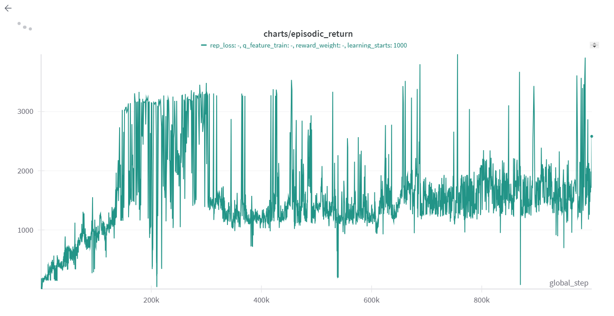

# Notes on Experiments

## SAC + contrastive learning

### 24/01/2025 - \<Exps 1\>

**Setting**
* env = __Hopper-v4__
* Contrastive Learning losses implemented in the cleanrl baseline:
    * Noise Contrastive Estimation (NCE) from [Making Linear MDPs Practical via Contrastive Representation Learning](https://arxiv.org/pdf/2207.07150) (1)
    * Spectral Contrastive Loss (SpectralCL) from Pie
    * Supervised Contrastive Loss (SupervisedCL) from Ruohan [Supervised Contrastive Learning](https://arxiv.org/pdf/2004.11362.pdf)
* Goal: See if Q-function can be linearized in $<\phi(s,a), \theta>$
* Important note: the Q-function we are considering is $Q^\pi(s,a) = r(s,a) + \gamma \mathbb{E}[V^\pi (s')]$ because of a (undemonstrated) claim in App. B of (1) in which they say " for function completeness, we should and one more nonlinear component for capturing $log \pi (a|s)$ " which is present in the original Q-definition in SAC. To make a fair comparison between the SAC baseline and SAC+CL, removed this entropy term from both.

**Experiments**
* General: the baseline touches reward of 3k but it seems to converge between 1k and 2k. 
* General CL
    * All CL losses reaches a plateaux of maximum 1k
    * Sampling 25k samples instead of 1k before the learning start doesn't seem to help
    * Training the embeddings also during the Q updates increases a lot the perfromance
    * SCE is the only one not able to stay around 1k of reward
    * All CL losses produce noisy results
    * NCE and Spectral have a rew. prediction error of 0.00something, while Supervised has an error of 0.0something. It is very low error (I guess)

**Open questions**
* Do we need some other tricks during training? For example:
    * Pretrain embeddings
    * Pretraining and freezing embeddings values
    * More extra steps for embeddings (i.e. every 1 critic training step -> n embedding training steps)
    * Gradient Clipping
* Does it work with 2 layers in Q-net?
* What are the results of the original NCE code?
* Is hopper too complicated, what are the performance on other simpler envs?
* What about PPO?

**Setting 2**
* env = __HalfCeetah-v4__
* Same as before

**Experiments**
* General CL
    * Here, the results are nuch worse. There is not a raising up curve. The rew is between -500 and 0 (vanilla sac reches 10k). This makes me think that 1000 rew in Hopper is a very low rew and I should save some gifs
    * Training features with critic learning makes the contrastive loss going up (instead of going down), together with q_loss
    * If we freeze embedding training during critic learning we have feat loss going down and q_loss with a triangular shap (going up at first (peak of 32) and then going down (until 25)). 
        * This result is the opposite of what we saw in hopper
        * In (1), they freeze the embeddings training during q and policy training, while here we train that always during policy and we chose whether or not to train that during q learning. Let's try their approach

### 27/01/2025 - \<Exps 2\>

**Setting**

* env = __Hopper-v4__
* Major Changes:
    * BEFORE: train embeddings always during policy and chose to train or not during q learning-> NOW: freeze the embeddings training during q and policy training
    * BEFORE: always 1 critic layer -> NOW: we chan choose the number of critic layers (our goal is to have just one)
    * **THERE WAS A MAJOR BUG**
    * doing it again...

### 27/01/2025 - \<Exps 3\>

**Setting**

* env = __Hopper-v4__
* Major Changes:
    * BEFORE:  freeze the embeddings training during q and policy training -> NOW: allow embedding training during policy training
    * **THERE WAS A MAJOR BUG**

### 24/01/2025 - \<Exps n\>

**Setting**

* env = __Hopper-v4__/__HalfCeetah-v4__
* Major Changes:
    * BEFORE:  allow embedding training during policy training -> NOW: NOT allow embedding training during policy training just during Q learning
